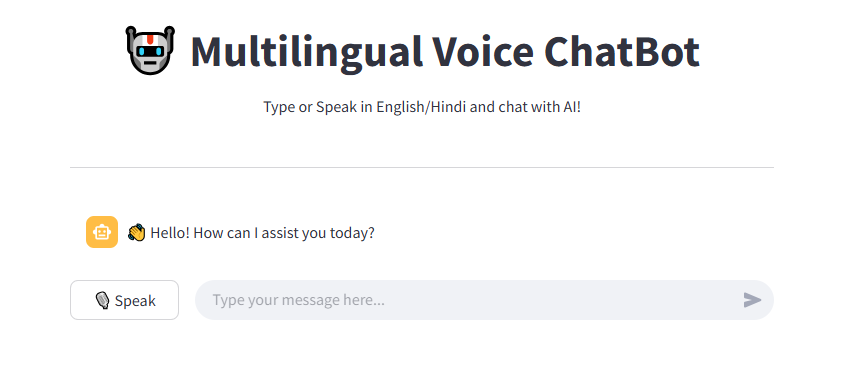

# 🤖🎙️ Multilingual Voice ChatBot (English + Hindi)

This project is a smart, voice-enabled chatbot built using **Google Gemini AI** and **Streamlit**. It supports both **English and Hindi**, allows users to chat using **voice or text**, and responds using speech!

> Speak or type your thoughts — the bot listens, understands, and talks back!

---

## 🚀 Features

- 🌐 **Multilingual**: Supports English and Hindi seamlessly.
- 🎙 **Voice Input**: Speak into the mic to chat.
- 🔊 **Voice Output**: Bot replies using text-to-speech.
- 🤖 **Powered by Gemini**: Uses Google’s Gemini 1.5 Pro model.
- 💬 **Interactive UI**: Clean and responsive Streamlit interface.
- ⚙ **Rate Limited**: Handles API call delays gracefully.
- 🛡 **Error Handling**: Smart fallback for API or speech errors.

## 🧰 Tech Stack

- 🧠 Google Generative AI (Gemini 1.5 Pro)
- 🌐 Streamlit
- 🗣 SpeechRecognition (voice-to-text)
- 🔉 pyttsx3 (text-to-speech)
- 🐍 Python

## 📸 Screenshot

Here’s how the chatbot looks in action:

